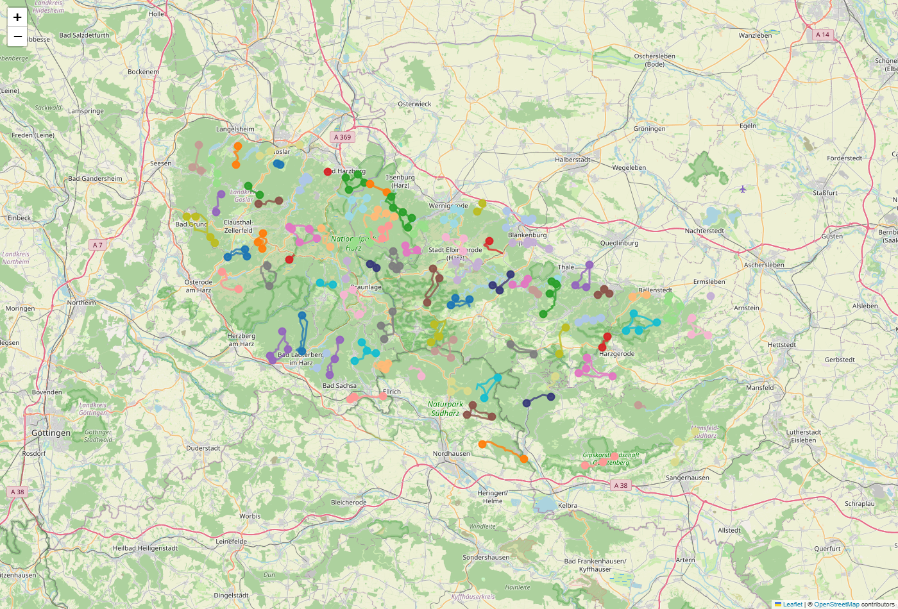

# Harz Wanderung — Saturday trip planner

Plans Saturday day-trips to collect all 222 Harzer Wandernadel stamps,
starting from Clausthal-Zellerfeld. Real walking-network distances, real
elevation, parking trailheads, and drive times — not straight lines.

## Setup

Needs [uv](https://docs.astral.sh/uv/). Then:

    uv sync

## Run the whole pipeline

    uv run python -m harzplan

Every stage caches its result and skips itself on the next run, so the
command is safe to repeat and resumes after any crash:

| Stage   | What it does                                 | Cache file                                       |
|---------|----------------------------------------------|--------------------------------------------------|
| acquire | official stamp list -> `data/stamps.geojson` | `cache/hwn_gpx.zip`                              |
| network | OSM walking graph + DEM + distance matrix    | `cache/graph_elev.pkl`, `cache/stamp_matrix.npz` |
| cluster | stamps -> day-trip groups                    | `cache/clusters.json`                            |
| route   | parking trailhead + walking loop per group   | `cache/parking.json`, `cache/routes.json`        |
| rank    | drive times from home, Saturday order        | `cache/drives.json`, `cache/ranked.json`         |
| outputs | plan.csv, GPX files, map, progress list      | `output/`                                        |

Delete a cache file to force that stage (and everything after it) to
rebuild. The `network` stage downloads a lot on its first run (the whole
Harz walking network from Overpass) and can take an hour — later runs
load the cache in seconds.

## The outputs

- `output/plan.csv` — one row per trip: trailhead, drive km/min, stamps,
  loop km, ascent, walking time (Naismith + Langmuir).
- `output/trips/trip_XX.gpx` — track + waypoints per trip; import into
  Komoot or any GPS app.
- `output/map.html` — all trips on one map, one colour per trip.
- `output/progress.md` — tick-off checklist with badge milestones
  (8 / 16 / 24 / 50 / 111 / 222 stamps).

## After a hike

Add the stamps you collected to `config.toml`:

    [progress]
    done = [1, 5, 12]

Then re-plan the remaining stamps (keeps the expensive caches):

    uv run python -m harzplan replan

## All settings

Everything lives in `config.toml`: home coordinates, loop limits
(10–18 km, max 600 m ascent), stamps per trip, Overpass endpoints,
walking-time rule, badge thresholds. No magic numbers in code.

## Data sources and license

- Stamp coordinates: harzer-wandernadel.de GPS download (prepared by
  Markus Gründel). Free for private personal use only — that is why
  `data/` is not part of this repository. The acquire stage downloads
  the file on first run; do not commit or redistribute it.
- Walking network and parking: OpenStreetMap via Overpass (ODbL).
- Elevation: Copernicus GLO-30 DEM (open data, AWS).
- Drive times: OSRM public demo server.
